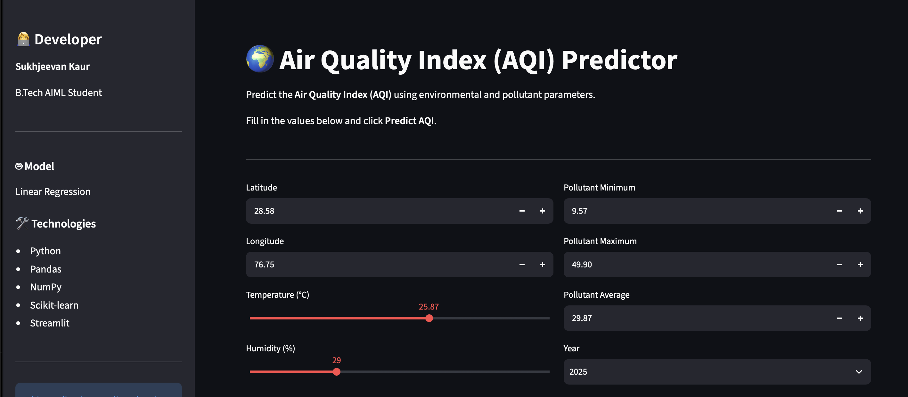
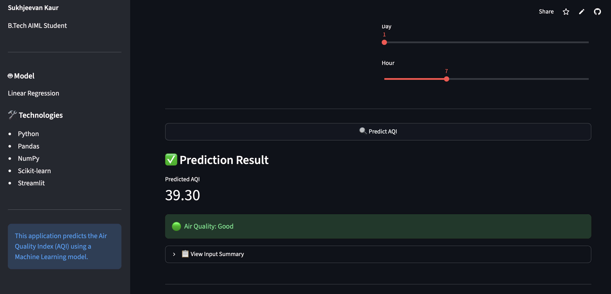
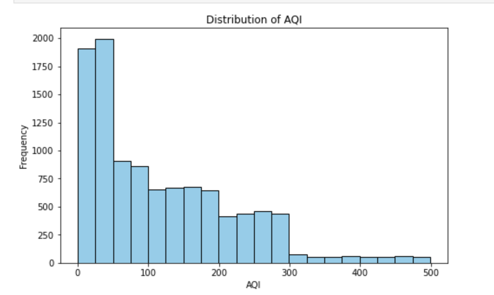
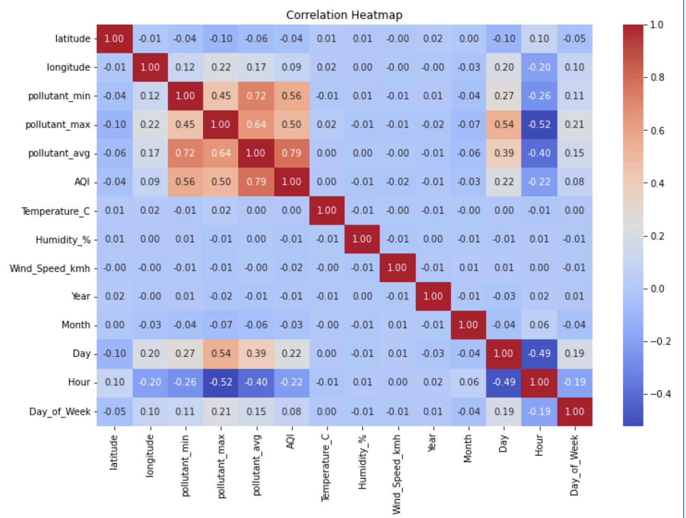
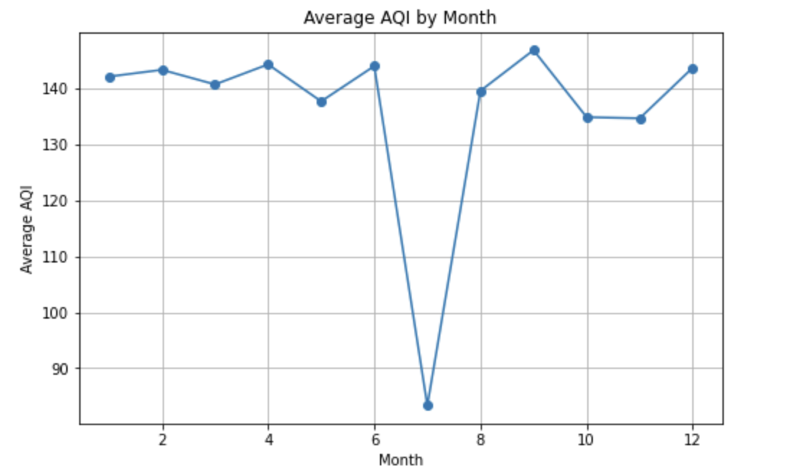
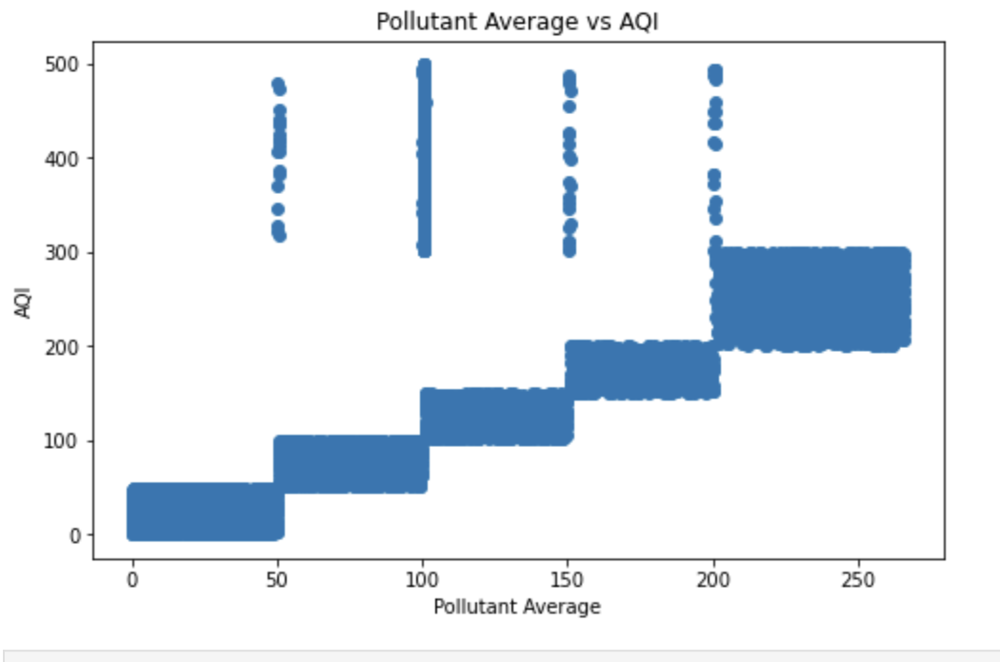

# Air Quality Index (AQI) Prediction Using Linear Regression

Air Quality Index (AQI) Prediction using Linear Regression with Data Analysis, Visualization, Machine Learning, and an Interactive Streamlit Web Application.

---

## 📌 Project Overview

This project predicts the Air Quality Index (AQI) using a Linear Regression machine learning model. The project includes data preprocessing, exploratory data analysis (EDA), model training, evaluation, visualization using Python, and an interactive Streamlit web application where users can enter environmental parameters to predict AQI instantly.

---

## 🌐 Live Demo

🔗 **Try the Web App:**  
**[https://aqi-prediction-using-linear-regression-nrcjwqcunhicydhqrtkpvb.streamlit.app/]**

---

## 🖥️ Web Application Preview

##APP PREVIEW 


## RESULT



## 🎯 Objectives

- Analyze the Air Quality dataset.
- Handle missing values.
- Perform Exploratory Data Analysis (EDA).
- Train a Linear Regression model.
- Predict AQI values.
- Evaluate the model using standard metrics.
- Build an interactive Streamlit web application for AQI prediction.

---

## 📂 Dataset

The dataset contains environmental and pollutant-related information used to predict AQI.

The dataset contains information such as:

- Latitude
- Longitude
- Pollutant Minimum
- Pollutant Maximum
- Pollutant Average
- Temperature
- Humidity
- Wind Speed
- Year
- Month
- Day
- Hour
- AQI (Target Variable)

---

## 🛠️ Technologies Used

- Python
- Pandas
- NumPy
- Matplotlib
- Seaborn
- Scikit-learn
- Streamlit
- Joblib
- Jupyter Notebook

---

## 📊 Exploratory Data Analysis (EDA)

The following visualizations were generated to better understand the dataset:

- AQI Distribution Histogram
- AQI Box Plot
- Correlation Heatmap
- Monthly AQI Trend
- Pollutant Average vs AQI Scatter Plot
- AQI Bucket Distribution
- AQI Bucket Pie Chart
- Temperature Distribution
- Humidity vs AQI
- Wind Speed Distribution

---

## 📸 Project Visualizations

### AQI Distribution Histogram



### AQI Box Plot


### Correlation Heatmap



### Monthly AQI Trend



### Pollutant Average vs AQI Scatter Plot



---

## 🤖 Machine Learning Model

**Algorithm Used:** Linear Regression

The dataset was divided into training and testing sets. A Linear Regression model was trained and evaluated using standard regression metrics.

The trained model was saved using **Joblib** and integrated into a **Streamlit web application** for real-time AQI prediction.

---

## 🌐 Interactive Web Application

The project includes an interactive Streamlit web application that allows users to:

- Enter environmental parameters.
- Predict AQI instantly using the trained Linear Regression model.
- View predictions through a simple and user-friendly interface.
- Experience real-time machine learning predictions directly from the browser.

---

## 📈 Model Evaluation

**Evaluation Metrics:**

- Mean Absolute Error (MAE)
- Mean Squared Error (MSE)
- Root Mean Squared Error (RMSE)
- R² Score

**Model Accuracy (R² Score): 68.33%**

The model achieved a moderate prediction accuracy, demonstrating the relationship between environmental factors and AQI values.

---

## 📂 Project Structure

```text
AQI-Prediction-Using-Linear-Regression/
│
├── airproject.ipynb
├── app.py
├── linear_regression_model.pkl
├── enriched_aqi_dataset.csv
├── requirements.txt
├── README.md
└── images/
    ├── aqi_distribution.png
    ├── aqi_boxplot.png
    ├── correlation_heatmap.png
    ├── monthly_aqi_trend.png
    └── pollutant_vs_aqi.png
```

---

## ▶️ How to Run

1. Clone or download the repository.

2. Install the required Python libraries.

```bash
pip install -r requirements.txt
```

3. Launch the Streamlit application.

```bash
streamlit run app.py
```

4. Open the local URL displayed in your browser.

---

## 📌 Future Improvements

- Improve prediction accuracy using advanced machine learning models.
- Integrate real-time AQI data using APIs.
- Add more interactive visualizations and analytics.
- Enhance the user interface and user experience.

---

## 👩‍💻 Author

**Sukhjeevan Kaur**

B.Tech in Artificial Intelligence & Machine Learning (AIML)
Summer Training Project – Python & Machine Learning
